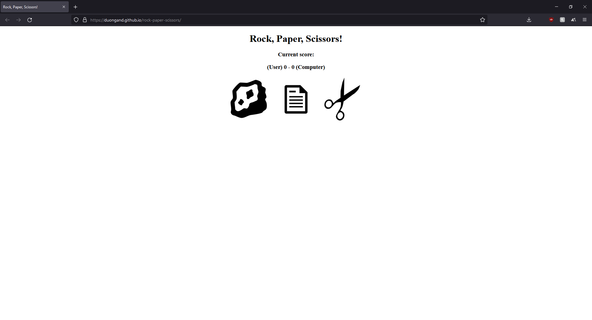

## rock-paper-scissors

A classic game played by many during their early days.

[Live Demo](https://duongand.github.io/rock-paper-scissors/)

### Summary
Rock, paper, scissors is a game that many grew up with due to its simplicity to handle fueds. Commonly played in a best of three format, `rock-paper-scissors` allows unlimited tries to test your luck or skill against probability.

### Author
* **Anderson Duong** - Full-Stack Developer